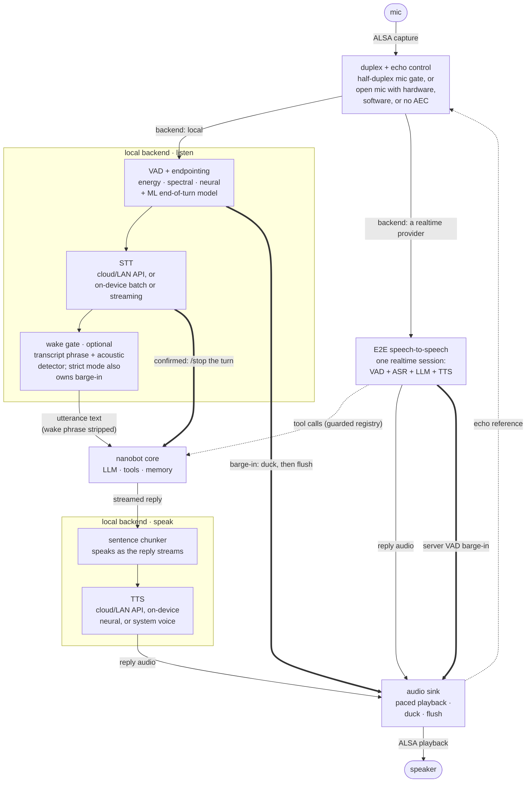

# nanobot-channel-voice

A voice channel plugin for [nanobot](https://github.com/HKUDS/nanobot), talk to your agent naturally over audio.

- **ALSA-direct**: capture and playback via `arecord`/`aplay`, shared `dsnoop`/`dmix`/`plug` devices work by name with no extra audio dependencies.
- **Pluggable STT**: reuses nanobot's own `transcription` config (Whisper, cloud or LAN), or runs on-device over ONNX/RKNN, batch or streaming (decoding *while* you speak).
- **Pluggable TTS**: OpenAI-compatible `/audio/speech` (cloud or a local server), on-device over ONNX/RKNN, or zero-dependency `espeak-ng`/`say`.
- **Two on-device inference backends**: `.onnx` (CPU, or GPU/DLA on Jetson via the TensorRT/CUDA execution providers) and `.rknn` (Rockchip NPU). One `OnDeviceModel` dispatches on file extension, so the same adapter code drives both.
- **Duck-then-confirm barge-in**: half-duplex mutes the mic while speaking, or the open-mic modes (hardware AEC, software AEC3, or none at all) duck the reply the moment you start talking, then confirm. A real interruption stops playback (with streaming STT, mid-sentence) and the agent is told how much of its reply you actually heard. An echo, a cough, or an "uh-huh" releases the duck and the reply continues.
- **Wake word**: optional, off by default. Two tiers — a transcript-prefix match in any language the STT covers, plus an acoustic detector (openWakeWord) that hears through the bot's own playback. `gate` asks for the phrase on a cold start and then leaves follow-ups natural for a while; `strict` also makes the phrase the *only* thing that interrupts a reply, so a room full of other people never cuts it off. A summon can answer with a spoken ack or a wordless earcon.
- **E2E speech-to-speech**: alternative backend, one WebSocket session to an OpenAI-Realtime-dialect provider or Gemini Live does turn detection + ASR + reasoning + TTS, while the model's tool calls still route through nanobot's guarded tool registry. The on-device VAD and wake word can gate what leaves the box (`realtime.uplink`), so a cloud brain is billed for speech, not for listening.



> Thick arrows are the interrupt path, dotted ones side channels; the bullets above name the engines behind each slot.

## Install

nanobot (>= 0.3.5) discovers channels as subpackages of `nanobot.channels`; this wheel installs a dependency-free manifest into that namespace (`nanobot/channels/voice`). It needs Linux with ALSA, Python 3.11-3.13 (a [uv](https://github.com/astral-sh/uv)-managed venv is recommended).

```sh
uv pip install nanobot-ai
uv pip install -e ./nanobot-channel-voice
nanobot channels status
```

The default stack (ALSA, energy VAD, OpenAI-compatible TTS) needs no extras. Each of these is lazily imported, so the plugin runs and degrades gracefully without them:

- `[ondevice]` is every on-device engine over local ONNX models (CPU, via onnxruntime): STT `whisper`/`sensevoice`/`zipformer`, TTS `mms`/`supertonic`/`matcha`, VAD `firered`/`silero` (Silero VAD v6), end-of-turn `smartturn` (Smart Turn v3). Matcha's English front-end needs espeak-ng: the system package, or add `[espeak]` for a pip-bundled library on boards without a package manager.
- `[rknn]` adds Rockchip's NPU runtime (`rknn-toolkit-lite2`) for `.rknn` artifacts, on top of `[ondevice]`. Requires aarch64 arch and Python <= 3.12, elsewhere it installs nothing, since `.onnx` is the non-board path.
- `[realtime]` is the WebSocket client for the E2E cloud backends (`backend: "openai"` and its dialects, `"gemini"`).
- `[aec]` is software echo cancellation (`aec: "webrtc"`, WebRTC AEC3), large wheel.
- `[webrtc]` is the spectral VAD (`vad.engine: "webrtc"`).
- `[pyalsa]` is the in-process libasound backend (`audio.backend: "pyalsa"`) instead of the `arecord`/`aplay` subprocesses, needs `libasound2-dev` to build.
- `[otel]` exports tool-call outcomes to OpenTelemetry (`telemetry.enabled`), cloud backends only.
- `[uroman]` / `[japanese]` are MMS-TTS text frontends for non-Latin scripts (`tts.mms.textFrontend`): romanization, and kanji-aware readings for Japanese (need build).

## Get started

Run `nanobot webui` and open **Settings -> Channels -> Voice**. On a core that ships the voice panel, the pane is a form the channel shapes for its own state: pick a backend and the form shows the sections it uses.

- **Resolved setup** is re-checked on every edit and says what will run: which engine would fall back at start and why, what the chosen backend ignores, and the audio devices that open.
- **Models**: an on-device engine's **Model** pills come from the index named under **Model index** in General (the built-in one unless you set another). **Apply** downloads what the setup runs, removes the models the panel installed that it no longer runs, then starts or restarts the channel. A model whose license carries a notice waits for your tick under **Models**.
- **Advanced** adds the less common rows in place (hardware, audio-path and listening details, thresholds and timings, phrase lists) and the sections this setup does not use, each with a note naming the switch that would; a value set in a hidden row stays in force. It also holds **Config import**, for pasting a whole section or a patch, and **Reset to defaults**, a pending edit like any other that **Discard pending changes** undoes.
- **Defaults** are the schema's, beneath `$NANOBOT_VOICE_DEFAULTS` in the gateway environment when set (a partial section, as a JSON file path or the JSON itself): how a board image ships its baseline, which Reset returns to. They supply values, not activation: nanobot starts the channel only when `config.json` has `channels.voice` with `"enabled": true` (what the toggle writes), so an image writes that much and lets the rest show through; an `enabled` in the defaults is ignored.

On an official core without the panel, the pane is a single **Import Json** box that takes the same section or a partial patch, and a refused paste says why when you enable the channel. A paste never sets `enabled`, which belongs to the channel's toggle.

Either way, edits stay pending until the channel (re)starts and writes them into `config.json`. Until then they are kept as written, API keys included, and echoed to every signed-in WebUI session, so enable or **Apply** soon after typing a key. A start failure shows its reason in the channel's **Failed** box.

`nanobot-voice config` prints the current section back, paste-ready (API keys withheld unless `--secrets`). [Example Configs](docs/EXAMPLE_CONFIGS.md) has copy-pasteable setups, [the panel in detail](docs/EXAMPLE_CONFIGS.md#the-voice-panel) and troubleshooting. The schema, [config.py](nanobot_channel_voice/config.py), documents every key's default, range and notes.

Setups vary too much for one recipe (hardware, languages, cloud vs local, interactivity), so let an agent drive: run a coding agent (e.g. Claude Code) on the target machine and paste this prompt:

```
Set up nanobot-channel-voice (https://github.com/iChizer0/nanobot-channel-voice) on this machine. Ground truth: docs/EXAMPLE_CONFIGS.md and the schema in nanobot_channel_voice/config.py; inspect first (OS/arch, RAM, sound devices via arecord -l / aplay -l, NPU, network, existing nanobot config).
Ask me one round of questions (reply languages, cloud keys or fully local, barge-in or half-duplex, wake word, latency vs quality), then pick the stack: cloud engines when keys + network allow, else on-device ([ondevice]/[rknn] extras), models via nanobot-voice sync, AEC only with a raw-PCM TTS at a rate divisible by 100.
Verify audio with a short record + replay (dsnoop/dmix if the card is shared), write channels.voice, validate with `nanobot channels status`, then a live smoke test - a robotic espeak voice means a fallback fired, fix the logged cause. Ask before installing packages or spending credits; finish with the final config and each choice's trade-off.
```

## License

See [LICENSE](LICENSE). Optional on-device model weights carry their own licenses, review them for your deployment, no weights are bundled.
